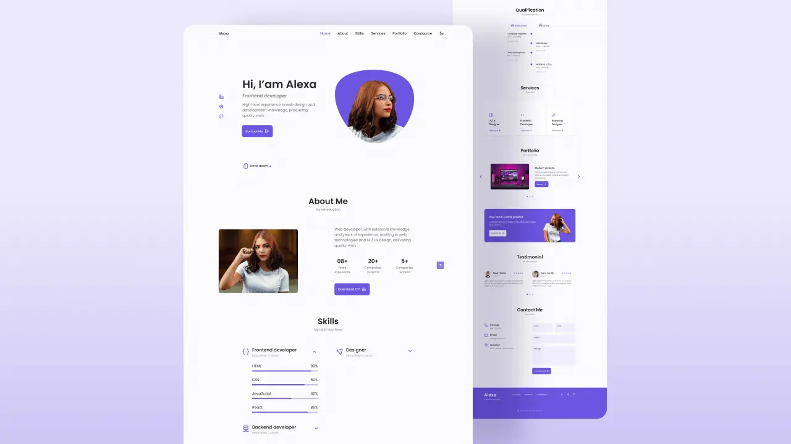

# Responsive Portfolio Website Alexa Template
### Responsive Portfolio Website Alexa


Currently, this webpage is about responsive portfolio website template, This repository can be used to make a complete webpage, this works as a template of full portfolio webpage.

<hr>

💙 Join the channel to see more videos like this. [Code_With_Pankaj](https://www.youtube.com/c/CodeWithPankaj1?sub_confirmation=1)
<hr>

<div align=center>

## Must visit 👇 (Click on it)

[](https://www.youtube.com/c/CodeWithPankaj1?sub_confirmation=1)

</div>

<hr>

## Features

- A responsive design.
- Effect of hovering.
- The width of the device will be automatically fixed.
- Responsive Personal Portfolio Website Using HTML CSS & JavaScript
- Smooth scrolling in each section.
- Includes a light and dark mode.
- Developed first with the Mobile First methodology, then for desktop.
- Compatible with all mobile devices and with a beautiful and pleasant user interface.


## Authors

- [@pankajbaliyan](https://www.github.com/pankajbaliyan)


## Contributing

Contributions are always welcome!

See `index.html` for ways to get started.

Please adhere to this project's `code of conduct`.


## Demo

https://responsive-portfolio-website-alexa-cwp.vercel.app
<br><br>
https://pankajbaliyan.github.io/Responsive_Portfolio_Website_Alexa/


## Feedback

If you have any feedback, please reach out to us at pankajbaliyan90@gmail.com


## 🔗 Links

[](https://www.linkedin.com/in/pankaj-kumar-90/)

<br>

[](https://codewithpankaj.vercel.app)

## Lessons Learned

I learned many things while making this repository, i.e. how to make a webpage responsive to all devices screens and how to make a basic & decent portfolio webpage to showcase your skills.
## Run Locally

Clone the project

```bash
  git clone https://github.com/PankajBaliyan/Responsive_Portfolio_Website_Alexa_Template.git
```

Go to the project directory

```bash
  cd Responsive_Portfolio_Website_Alexa_Template
```

Start code editor

```bash
  code .
```


## Screenshots




## Support

For support, email pankajbaliyan90@gmail.com or join our Slack channel.